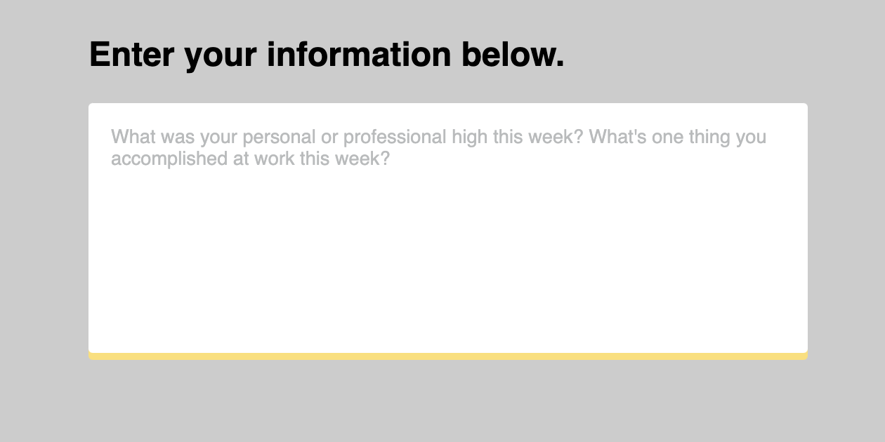
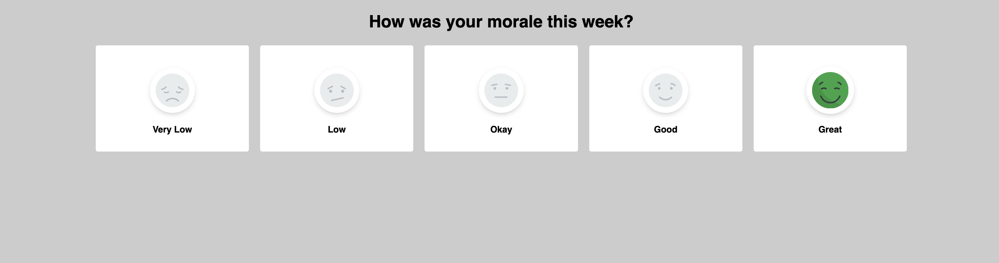

# Niko's Contributions
Here are a couple snippets that can make for some cleaner and more modern radio and textarea input fields:

## Label within textarea
This is a textarea with a label that looks like it sits within it. When the textarea is active, the label moves up and out of the way and a yellow shadow appears on the bottom.

[Source](label-within-textarea)

## Stylized radio buttons
These are radio buttons stylized with images that change when selected.

[Source](stylized-radio-buttons)
